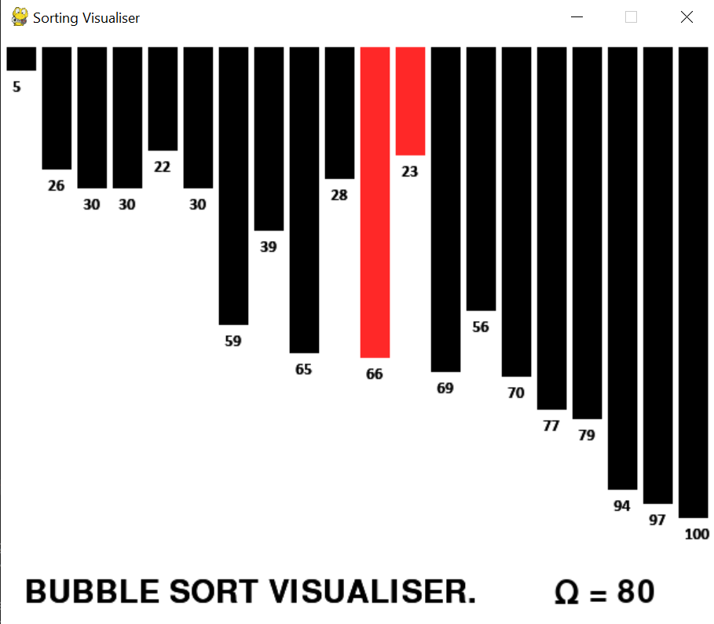

# Sorting Visualiser

## Overview

This is a sorting visualiser built in Pygame, that displays the inner workings of the bubble sort algorithm.



## Inputs

- ```Space``` to run the algorithm
- ```R``` to reset the inputs (only when the algorithm is not running, if you press it when the algorithm is running it will immediately reset when done)
